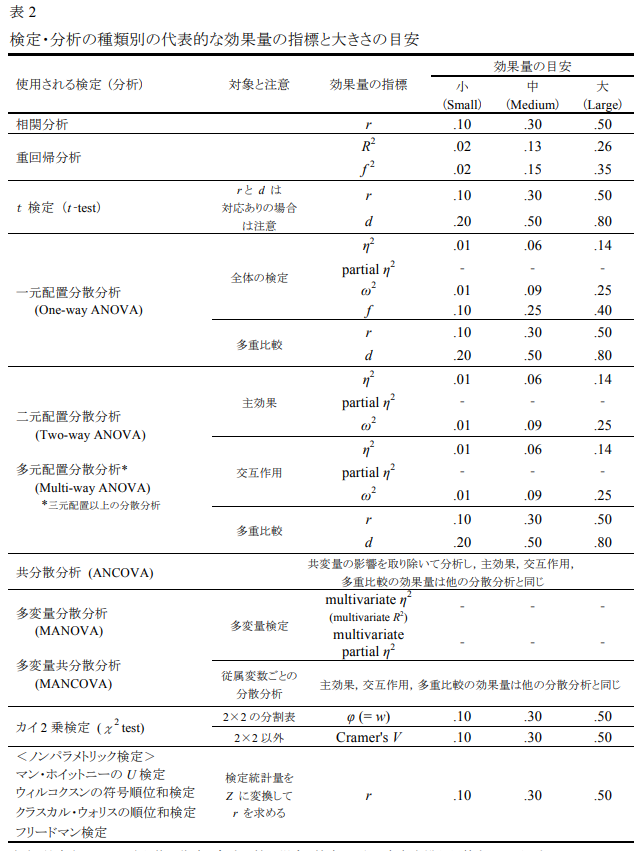

# Week 12: 効果量と検定力分析

```{r, include=FALSE}
library(rstan)
library(brms)
library(gt)
library(tidyverse)
library(kableExtra)

rstan_options(auto_write = T)
options(mc.cores = parallel::detectCores())
```

## 🚧🚧🚧🚧


## 事前の確認

- この講義のRプロジェクトを開いていますか？
- 英数字で名前を付けた本日の講義のファイルを作成しましたか？

  - .Rでも.Rmdでもどちらでも大丈夫です。

## 今日の目標

1. 
2. 

## 効果量
- 統計的検定の問題点：サンプルサイズが大きくなればなるほど、実質的に差がなくても統計的有意であるという結果になりやすい。

  - *p* 値のみに注目するのは危険
  
  - *p* 値は実質的な差の大小は教えてくれない
  
- *p* 値のみではなく、効果量の両方を報告する

- 中村（2025）のイントロダクションを参考にする

### 様々な検定の効果量

- *t* 検定の効果量

- 水本先生の本から記載する

- 回帰分析の効果量

## 効果量基準一覧
- 水本・竹内（2010）より引用

```{r, echo=FALSE, out.width='80%', fig.align='center'}

```


## 検定力

## ハンズオン・セッション
- pwr関数などを使う


## 次週までの課題
### 課題内容

1. 小テストに向けて今回の内容を復習する。必ず手でコードを入力してRを実行する。

2. （宿題を考える）
- ハンズオンセッションで使用したデータを基にサムコントラストで分析をしてみましょう

- **Rで数値を出力するだけでなく、それぞれの質問への回答を高校生にもわかりやすく文字で記載してください。**

### 提出方法
- メールにファイルを添付して送信。
- 締め切りは今週の木曜日まで

## 参考文献
- 📚竹内・水本（編著）（2023）『外国語教育研究ハンドブック【増補版】―研究手法のより良い理解のために』松柏社

- 📚中村（2025）『心理学・教育学研究のための効果量入門―Rを用いた実践的理解』北大路書房

- 水本・ 竹内 (2010). 「効果量と検定力分析入門―統計的検定を正しく使うために―」 『メソドロジー研究部会報告論集』 47-73.

```{=html}
<style>
.infobox {
  padding: 1em 1em 1em 4em;
  margin-bottom: 10px;
  border: 2px solid orange;
  border-radius: 10px;
  background: #f5f5f5 5px center/3em no-repeat;
}

.beg {
  background-image: url("https://blogger.googleusercontent.com/img/b/R29vZ2xl/AVvXsEjHtu3kBX8P39WYBBAjar9c8c1ladK2SYL6_gEMXFweQfauWVhSvCQP5KELsPX5KNL1uOddLLQ-aeMxv904OW_NFFfANhBYObfBV09KO2EXehrb9kMdCLZY1afsChib-7zIkBJbG6OrbJpM/s400/aisatsu_kodomo_boy.png");}

.caution {
  background-image: url("https://blogger.googleusercontent.com/img/b/R29vZ2xl/AVvXsEhzMqkpQ7vLUKvumbm6AFwTLQiCe7tlDb2Q0MAiISLsesZHnhj0kbRjB4U3se3UrDIHfIy0hlahyphenhyphenQu-V2tOR2LcV_lX7U8P5a8jtqPYv3Ah4L-JoYi8PhoaoehumGIdp2vrsX0rRyhXqwA/s800/mark_chuui.png");}
  
</style>
```